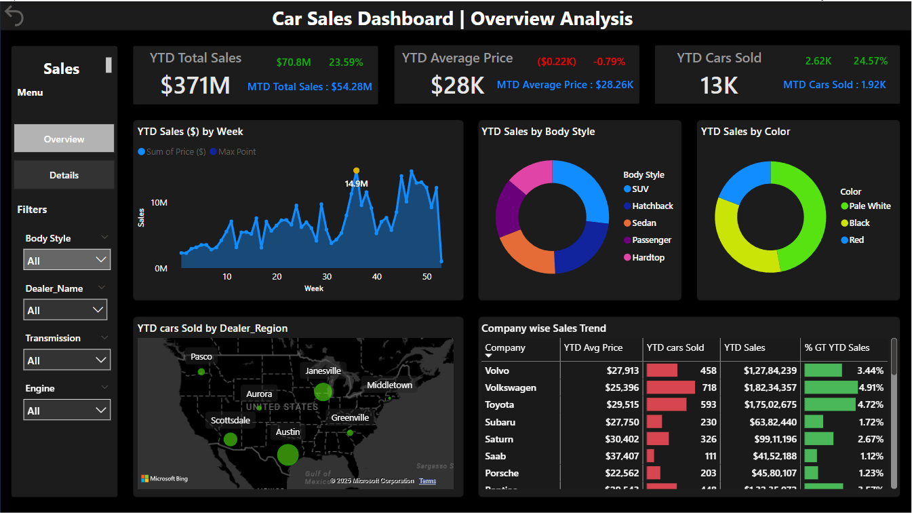

## Car Sales Analysis

  

## 📊 Overview

The objective of this project is to design and implement a comprehensive business intelligence dashboard using Power BI to monitor, analyze, and derive insights from car sales data. This dashboard is intended to serve as a decision-support system for automotive dealership executives, sales managers, and operational teams by providing a real-time, visual representation of key sales metrics and patterns.

## Dataset Used

| **Column Name** | **Description**                                | **Data Type** | **Example Value**                     |
| --------------- | ---------------------------------------------- | ------------- | ------------------------------------- |
| `Car_id`        | Unique identifier for the car                  | Object        | `C_CND_000001`                        |
| `Date`          | Date of the car sale                           | DateTime      | `2022-01-02`                          |
| `Customer Name` | Full name of the customer                      | Object        | `Geraldine`                           |
| `Gender`        | Gender of the customer                         | Object        | `Male`                                |
| `Annual Income` | Customer’s reported yearly income              | Integer       | `13500`                               |
| `Dealer_Name`   | Name of the car dealership                     | Object        | `Buddy Storbeck's Diesel Service Inc` |
| `Company`       | Car manufacturing brand                        | Object        | `Ford`                                |
| `Model`         | Specific model of the car                      | Object        | `Expedition`                          |
| `Engine`        | Engine type of the car                         | Object        | `Double Overhead Camshaft`            |
| `Transmission`  | Type of transmission (e.g., Auto, Manual)      | Object        | `Auto`                                |
| `Color`         | Color of the vehicle sold                      | Object        | `Black`                               |
| `Price ($)`     | Final sale price of the vehicle                | Integer       | `26000`                               |
| `Dealer_No`     | Unique code for the dealership                 | Object        | `06457-3834`                          |
| `Body Style`    | Body type of the vehicle (e.g., SUV, Sedan)    | Object        | `SUV`                                 |
| `Phone`         | Contact number (possibly masked or incomplete) | Integer       | `8264678`                             |
| `Dealer_Region` | Geographic region or location of the dealer    | Object        | `Middletown`                          |

## 📊 Key Analysis Areas

  

The dashboard analyzes the following key dimensions:
  - **Monitor Sales Performance at Scale**
     - Track key performance indicators (KPIs) such as total revenue, units sold, and average selling price across various dimensions (time, brand, region, model, etc.) to evaluate overall and segmented performance

  - **Identify Product & Customer Trends**
     - Analyze vehicle sales by body style, color, model, and brand to identify which products are most in demand, enabling more data-driven inventory and marketing strategies

  - **Regional & Dealer-Level Evaluation**
     - Compare sales performance across geographical regions and dealership networks to spotlight high-performing areas and uncover underperforming zones that may need attention or strategic intervention

  - **Understand Sales Seasonality & Timing**
     - Visualize weekly sales trends to uncover seasonal patterns, peak performance weeks, and monthly fluctuations, supporting more effective forecasting and promotional planning

  - Support Data-Driven Decision Making
     - Empower stakeholders to make faster, more informed decisions by replacing manual reporting with interactive, filterable dashboards that provide instant access to granular insights

  - Enhance Profitability & Efficiency
     - Use the insights to optimize pricing strategies, reduce slow-moving inventory, and improve sales conversion by focusing efforts on high-margin products and top-selling dealers

## 📈 Business Insights 

 1.  KPI Summary

  | Metric                | Value                         | Insight                                                                                                        |
  | --------------------- | ----------------------------- | -------------------------------------------------------------------------------------------------------------- |
  | **YTD Total Sales**   | \$371M (↑ \$70.8M / +23.59%)  | Strong year-to-date growth — indicates increased demand or successful sales campaigns.                         |
  | **YTD Average Price** | \$28K (↓ \$0.22K / –0.79%)    | Slight dip in average pricing — possibly due to discounting or selling more budget models.                     |
  | **YTD Cars Sold**     | 13K units (↑ 2.62K / +24.57%) | Strong volume growth; aligns with revenue increase. Possibly more units sold at slightly lower price per unit. |

  Volume-led revenue growth suggests expansion into lower-priced or mid-tier vehicles is working. Margin management might be a concern due to lower average price.

  2. YTD Sales ($) by Week 
     - Consistent weekly growth with a peak at week 35 (~$14.9M)
     - Likely a successful seasonal campaign (e.g., summer sales or new model release)

  3. Customer Behavior & Product Insights
     - SUVs and Sedans dominate the market share, aligning with broader industry trends that favor versatility, safety, and space
     - Pale White and Black are the most purchased colors, reflecting a preference for resale-friendly, conservative choices. Less demand for bold colors like Red confirms a general shift toward functionality over flair
     These patterns help in forecasting demand, streamlining inventory, and designing targeted marketing campaigns that match actual customer buying behavior.

  4. Geographic & Dealer Performance Analysis
     -  Cities like Austin, Greenville, and Janesville consistently outperform, likely due to strong dealer presence, local demand, or brand trust
     -  Other regions (e.g., Pasco, Aurora, Scottsdale) show subdued performance, signaling operational bottlenecks, poor customer engagement, or limited product variety
       
  5. Company-wise Sales Trend
      | Company                              | YTD Avg Price    | YTD Units Sold | YTD Sales | % of Total |
      | ------------------------------------ | ---------------- | -------------- | --------- | ---------- |
      | **Volkswagen**                       | \$25,396         | 718            | \$1.82M   | 4.91%      |
      | **Toyota**                           | \$29,515         | 593            | \$1.75M   | 4.72%      |
      | **Volvo**                            | \$27,913         | 458            | \$1.27M   | 3.44%      |

     - Volkswagen, Toyota, and Volvo lead in both units sold and YTD revenue
     - Luxury brands such as Porsche, Saab, and Cadillac, while lower in volume, still present margin-boosting opportunities

## Key Insights
  - The business recorded a total YTD sales value of $371M, up $70.8M (+23.59%) from the previous period
  - 13,000+ units sold, an increase of 24.57%, while the average selling price dipped slightly to $28K (-0.79%)
  - This implies that growth is driven primarily by volume, not price — indicating strong demand for mid-range or economy vehicles
  - Regional and brand-level analysis uncovers critical insights into demand concentration and customer preferences

## Business Recommendations
| Area                     | Recommendation                                                                                                   |
| ------------------------ | ---------------------------------------------------------------------------------------------------------------- |
| **Sales Strategy**       | Expand in SUV/Sedan categories. Leverage high-performing months (week 35) for seasonal promotions                |
| **Inventory Planning**   | Stock neutral-colored vehicles (White, Black). Shift underperforming stock via discounts                         |
| **Regional Performance** | Focus on top-performing regions (Austin, Greenville) for investment. Audit underperforming dealers               |
| **Brand Management**     | Push high-margin premium brands through curated marketing. Maintain volume leaders with offers                   |
| **Pricing Strategy**     | Monitor price sensitivity — average price dropped slightly, but units sold increased. Balance margin vs. volume  |
| **Customer Insights**    | Segment buyers based on body style and color preferences for targeted ads and campaigns                          |

## 📌 Conclusion
