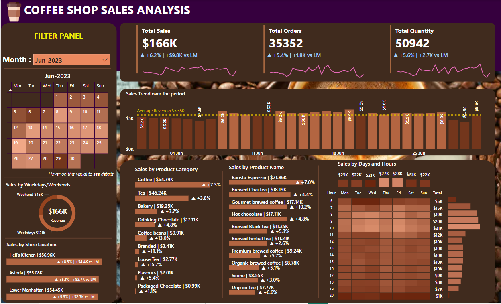

# ☕ Coffee Shop Sales Analysis

  

## 📊 Overview

In today’s competitive food and beverage industry, data-driven decision-making is not just a nice-to-have — it’s essential. This Power BI project focuses on analyzing six months of sales data (January to June) from a multi-location coffee shop chain. The goal was to uncover trends, highlight opportunities, and help business stakeholders make smarter, faster, and more informed decisions.
The dashboard tells the story behind every order — helping uncover which products customers love, when they prefer to visit, which locations are thriving, and where strategic improvements can be made.

## Dataset used

| **Column Name**    | **Description**                                           | **Data Type** | **Example Value**       |
| ------------------ | --------------------------------------------------------- | ------------- | ----------------------- |
| `transaction_id`   | Unique identifier for each transaction                    | Integer       | `1`                     |
| `transaction_date` | Date when the transaction occurred                        | String        | `01-01-2023`            |
| `transaction_time` | Time at which the transaction was completed               | String        | `07:06:11`              |
| `transaction_qty`  | Quantity of items sold in the transaction                 | Integer       | `2`                     |
| `store_id`         | Unique identifier for the store location                  | Integer       | `5`                     |
| `store_location`   | Name of the store location where the transaction occurred | String        | `Lower Manhattan`       |
| `product_id`       | Unique identifier for the product sold                    | Integer       | `32`                    |
| `unit_price`       | Selling price of a single unit of the product             | Float         | `3.0`                   |
| `product_category` | Broad category of the product                             | String        | `Coffee`                |
| `product_type`     | Specific type or sub-category of the product              | String        | `Gourmet brewed coffee` |
| `product_detail`   | Detailed name or description of the product               | String        | `Ethiopia Rg`           |

## 📊 Key Analysis Areas

  

The dashboard integrates and analyzes the following key dimensions:
  - **Sales Trends**
    - Monthly analysis of Total Revenue, Order Count, and Quantity Sold
    - Weekly Growth Tracking evry month
    - Average daily revenue trendline for performance benchmarking

 - **Product Category Performance**
    - Sales contribution by major categories: Coffee, Tea, Bakery, Drinking Chocolate, Coffee Beans
    - Identification of top-selling products (e.g., Barista Espresso, Brewed Chai Tea)
    - Growth comparison from January to June for each category
      
 - **Time-Based Behavior**
    - Hourly breakdown of sales volume
    - Day-of-week analysis to identify high-traffic business days (e.g., Fridays and Saturdays)
    - Insights into peak ordering windows (8 AM–11 AM is the most active period)
      
 - **Location-wise Analysis**
   - Comparison of revenue generated across stores (Hell’s Kitchen, Astoria, Lower Manhattan)
   - Growth trajectory by location over the six-month period
   - Assessment of performance consistency across outlets

## 📈 Insights and Recommendations

 1. Sales Performance Overview (Jan–Jun 2023)
    
    | Month | Total Sales | Total Orders | Total Quantity | MoM Growth (%) |
    | ----- | ----------- | ------------ | -------------- | -------------- |
    | Jan   | \$82K       | 17,314       | 24,870         | Baseline       |
    | Feb   | \$76K       | 16,359       | 23,550         | ▼ -6.8%        |
    | Mar   | \$99K       | 21,229       | 30,406         | ▲ +29.8%       |
    | Apr   | \$119K      | 25,335       | 36,469         | ▲ +20.3%       |
    | May   | \$157K      | 33,527       | 48,233         | ▲ +31.8%       |
    | Jun   | \$166K      | 35,352       | 50,942         | ▲ +6.2%        |

   -  Highest Revenue: June ($166K)
   -  Strongest Growth Spike: March to May (March: $99K → May: $157K, ~58.6% growth in 2 months)
   -  Lowest Revenue: February ($76K), with a drop of 6.8% from January

2. Sales by Product Category
   
    | Category               | Growth from Jan to Jun      | Top Growth Products                    |
    | ---------------------- | --------------------------- | -------------------------------------- |
    | **Coffee**             | \$31.26K → \$64.79K (▲107%) | Barista Espresso (\$10.46K → \$21.86K) |
    | **Tea**                | \$22.62K → \$46.24K (▲104%) | Brewed Chai Tea (\$8.76K → \$18.19K)   |
    | **Drinking Chocolate** | \$8.34K → \$17.11K (▲105%)  | Hot Chocolate (\$8.34K → \$16.32K)     |
    | **Bakery**             | \$9.54K → \$19.25K (▲102%)  | Scones (\$3.58K → \$8.55K)             |
    | **Coffee Beans**       | \$5.25K → \$9.91K (▲88.8%)  | Organic Brewed Coffee                  |

   - Coffee and Tea remain the core drivers, contributing ~67% of total sales
   - Consistent growth across all categories shows strong product portfolio performance

3. Sales by Hour and Day

    | Time of Day    | Top Performing Hours            | Top Day               |
    | -------------- | ------------------------------- | --------------------- |
    | **8 AM–11 AM** | Contributes >55% of daily sales | **Friday & Saturday** |
    | **6 PM–8 PM**  | Moderate performance spike      | Sunday                |

   - Morning time (8–11 AM) remains the prime sales window
   - Friday consistently records peak revenue (~$28K in June), ideal for promotions or launches

4. Sales by Store Location

    | Location        | Growth (Jan → Jun)  | Jun Revenue |
    | --------------- | ------------------- | ----------- |
    | Hell's Kitchen  | \$27.82K → \$56.96K | ▲105%       |
    | Astoria         | \$27.31K → \$55.08K | ▲101%       |
    | Lower Manhattan | \$26.54K → \$54.45K | ▲105%       |

   - Even growth across locations (~100%+), suggests well-distributed marketing and performance
   - Hell’s Kitchen slightly leads others – potential site for product testing or loyalty program pilots

5. Trends in Monthly Revenue & Avg Daily Sales

    | Month | Avg Daily Revenue |
    | ----- | ----------------- |
    | Jan   | \~\$2.6K          |
    | Feb   | \~\$2.7K          |
    | Mar   | \~\$3.2K          |
    | Apr   | \~\$3.9K          |
    | May   | \~\$5.1K          |
    | Jun   | \~\$5.6K          |

   - Steady growth in average daily revenue
   - April onward saw a significant rise, possibly due to seasonal demand or promotions

## Key Insights
   - **Revenue Growth**: Total monthly revenue increased from $76K in February to $166K in June — a 118% growth, indicating strong customer engagement and effective sales strategies
   - **Top Products Drive Profit**: Products like Barista Espresso, Brewed Chai Tea, and Hot Chocolate consistently ranked highest in sales, making them ideal candidates for seasonal promotions or bundle offers
   - **Morning is Prime Time**: Over 55% of daily sales occur between 8 AM and 11 AM, suggesting this window should be targeted for promotions, loyalty stamps, or "coffee rush" deals
   - **Friday is the Busiest Day**: Weekday sales outpace weekends, and Fridays consistently drive the highest revenue, possibly due to pre-weekend routines
   - **Consistent Store Growth**: All three store locations showed strong, steady revenue increases. Hell’s Kitchen slightly outperformed the others, making it a strategic location for piloting new products or services

## Business Recommendations

   - Peak hours between 8–11 AM should be targeted with: Flash offers, Breakfast combos, Loyalty coffee refills
   - Barista Espresso, Brewed Chai Tea, and Hot Chocolate lead revenue growth. They can be bundled with bakery items
   - Promote larger size options for these
   - Weekday sales (~75%) dominate weekends
   - Launch  exclusive combo deals like “Workday Warrior” to increase sale of bestselling items
   - Office subscription programs or loyalty apps
   - Target Hell’s Kitchen for Pilots, being the highest performer consistently, it’s best for: Piloting new items, hosting special events or sampling activities
   - Steady growth signals readiness for online ordering platform, partnerships with food delivery services or opening new outlets
   - Invest in inventory and visibility of Coffee, Tea, and Bakery sections
   - Introduce new seasonal flavors or limited-time beverages from items which are sold less

### 📌 Conclusion

The Coffee Shop Sales Analysis from January to June 2023 shows a strong upward trend, with sales increasing by over 118% from ₹76K in February to ₹166K in June. The most active sales hours are between 8–11 AM, and Fridays and Saturdays consistently drive the highest revenue. Hell’s Kitchen emerged as the top-performing store, while coffee remained the best-selling product category, led by items like Barista Espresso and Brewed Chai Tea. Steady month-over-month growth suggests successful marketing and customer engagement strategies. Targeting high-demand time slots, optimizing store operations, and leveraging popular products for promotions could further boost revenue.

