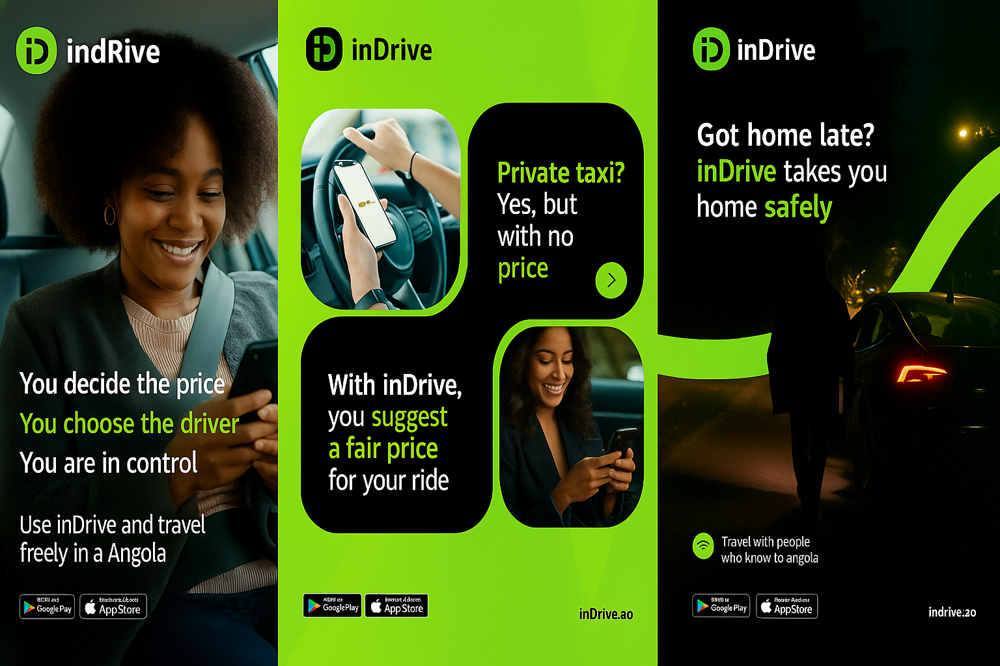
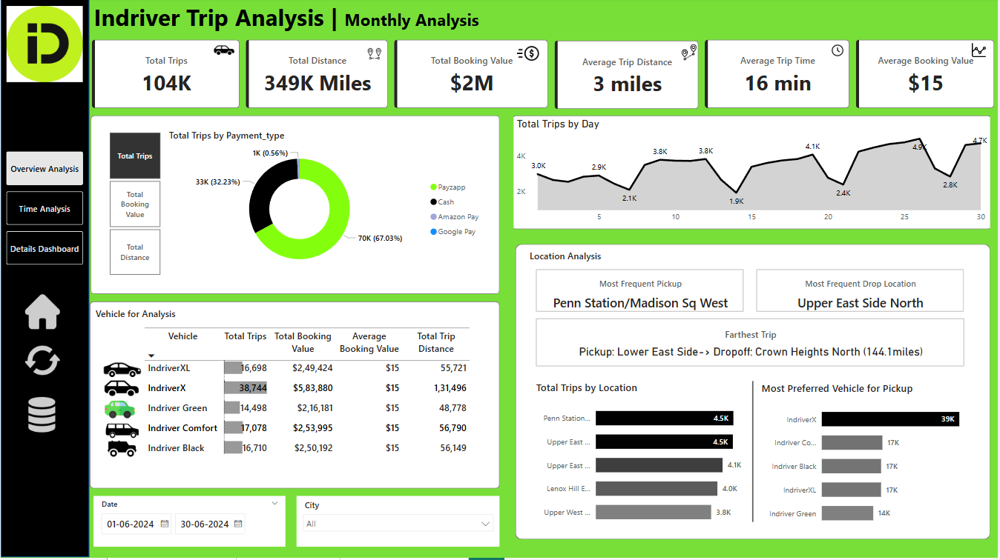
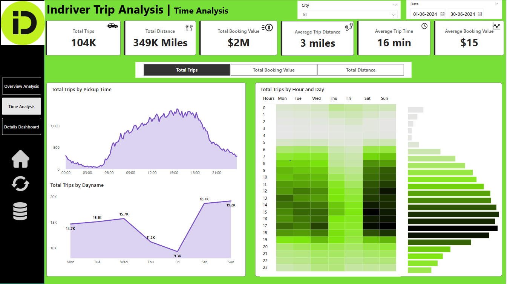
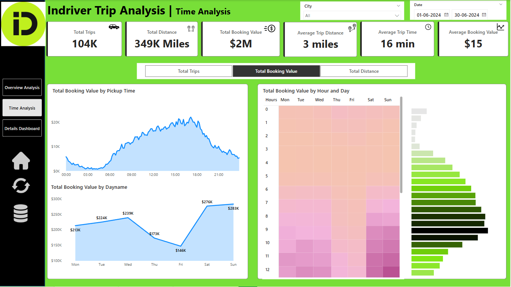
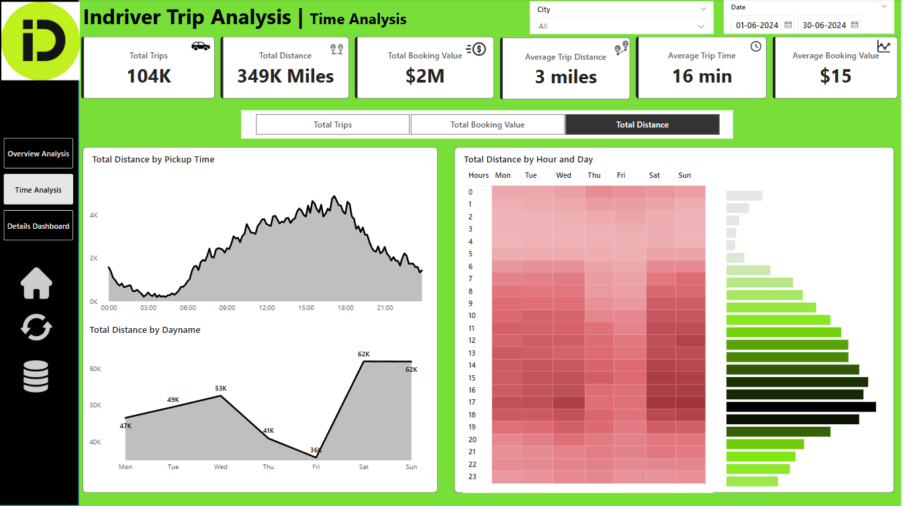

# 🚗 Indriver Ride Analysis

  

## 📊 Project Overview
This project analyzes monthly ride data from inDrive using an interactive Power BI dashboard. It tracks key metrics such as total trips, revenue, distance traveled, average fare, and trip time. The dashboard also breaks down performance by vehicle type, payment method, and popular pickup/drop-off locations. Daily trip patterns help identify peak demand days for better resource planning. User behavior insights support optimization of fleet allocation and pricing strategies. This analysis empowers inDrive to make data-driven decisions that improve efficiency and customer satisfaction. The insights serve as a foundation for scaling operations and enhancing the rider experience.

## Dataset Used

The analysis is performed on a single tables and columns with the following columns

- Trip Details Table

| Column Name       | Description                                                           |
| ----------------- | --------------------------------------------------------------------- |
| `Trip ID`         | Unique identifier for each ride/trip.                                 |
| `Pickup Time`     | Timestamp when the trip started.                                      |
| `Drop Off Time`   | Timestamp when the trip ended.                                        |
| `passenger_count` | Number of passengers for the trip.                                    |
| `trip_distance`   | Distance of the trip in miles.                                        |
| `PULocationID`    | Numeric ID representing the pickup location.                          |
| `DOLocationID`    | Numeric ID representing the drop-off location.                        |
| `fare_amount`     | Base fare charged for the trip in USD.                                |
| `Surge Fee`       | Additional fee applied during peak times or high demand.              |
| `Vehicle`         | Type of inDrive vehicle used (e.g., IndriverX, Indriver Black, etc.). |
| `Payment_type`    | Method of payment used (e.g., Payzapp, Cash, etc.).                   |

- Location Table

| Column Name  | Description                                                                |
| ------------ | -------------------------------------------------------------------------- |
| `LocationID` | Unique ID used to map trip pickup/drop-off locations.                      |
| `Location`   | Human-readable name of the area or neighborhood.                           |
| `City`       | City and region where the location belongs (e.g., Manhattan, Bronx, etc.). |

## 📊 Key Analysis Areas 

  

- **Overview Analysis**
1. **Overall Trip Metrics Overview**
   - Total Trips (**104K**): The business completed a total of 104,000 trips during the analyzed period, which is a high volume of transactions
   - Total Distance (**349K Miles**): This shows that the fleet has covered a significant distance, indicating that operations span large areas, possibly city-wide or in densely populated regions
   - Total Booking Value (**$2 Million**): This signifies that the business generated $2 million in revenue from these trips, which is a solid figure when considering the large number of trips taken
   - With **3 miles** as the average trip distance, it's likely the business operates in an urban area or city where short trips are more common, possibly catering to a daily commuter or urban resident demographic
   - The average trip time is **16 minutes**, confirming that these are relatively short, likely quick rides (e.g., from one part of a city to another), possibly for people on the go
   - The average booking value **($15)** seems low for each trip but when considering the large number of trips, it adds up to a significant total

2. **Payment Method Breakdown (Payment Type)**
   - **Payzapp** dominates as the preferred payment method **(67%)**, followed by Cash **(32%)**
   - The remaining Amazon Pay and Google Pay contribute much less, which could represent untapped potential for these digital payment methods
   - Since Payzapp leads, the business could explore loyalty programs or incentives that encourage further usage of digital payment methods to reduce cash handling
   - While cash transactions account for a significant portion **(32%)**, the business should aim to move customers toward digital payments. Promotions or small discounts for cashless payments could help in transitioning more customers
   - Amazon Pay and Google Pay are underused. Integrating promotional offers (e.g., discounts or cashback) for these methods could increase their usage
     
3. **Vehicle Analysis**
   - The **IndriverX** model leads with **38,744 trips** generating the maximum revenue, followed by **IndriverX Comfort (17,078 trips)**, and **Indriver Black (16,710 trips)**
   - The IndriverX model is the clear favorite, possibly due to price, comfort, or other vehicle-specific features. The business should consider expanding this fleet to meet demand
   - Even though IndriverX takes the most trips, other vehicles like Indriver Comfort and Indriver Black are also highly used, which shows a diverse customer preference

4. **Location Analysis**
   - **Penn Station/Madison Square West** stands out a sthe most frequent pickup location, followed by other locations like **Upper East Side North**
   - **Upper East Side North** is the most frequent drop-off location
   - The longest trip is from **Lower East Side** to **Crown Heights North**, covering **144.1 miles**, indicating the business is catering to longer-distance trips as well
   - **Penn Station** and **Madison Square West** are key pickup points, likely due to the concentration of customers in high-traffic areas. The business should ensure a high vehicle availability near these locations to capture demand
   - With **Upper East Side North** being the most frequent drop-off point, consider creating additional incentives or offers for passengers traveling to these areas to increase overall revenue

- **Time Analysis**
    - **Total Trips vs Time Analysis**
   

    
  
   

    1. **Total Trips by Pickup Time**
         - The above image shows the distribution of trips by pickup time throughout the day. It exhibits a peak around **9:00 AM to 11:00 AM** and another around **5:00 PM to 7:00 PM**, coinciding with typical rush hours. These are crucial times to ensure maximum vehicle availability.
         - The lowest point in the graph is in the early morning hours **(12:00 AM to 5:00 AM)**, which is a time of low demand
         - Late-night hours (especially from midnight to early morning) exhibit lower demand. This could be leveraged by offering discounts or incentives during these hours to balance fleet availability and demand

   2. **Total Trips by Day of the Week**
         - **Saturday** and **Sunday** see the highest number of trips, with **Sunday** reaching **19.2K trips** (the peak of the week). **Friday** also has a notable peak at **18.7K trips**
         - **Thursday** experiences the lowest trip volume at **9.3K**, which is significantly less than the weekend peak
         - **Sunday** is the most active day, with **19.2K trips**, followed by **Saturday (18.7K trips)**. This suggests that demand is much higher on weekends, which could be due to leisure activities, events, or travel
         - **Monday to Thursday** show lower trip volumes, with **Friday** seeing a slight increase, possibly due to end-of-week activities

   3. **Total Trips by Hour and Day (Heatmap)**
         - The heatmap provides a detailed breakdown of the number of trips by hour of the day and day of the week
         - The darker shades on the heatmap correspond to higher trip volumes, and the lighter shades represent lower trip volumes
         - The early morning hours (12:00 AM to 5:00 AM) are mostly light, indicating minimal activity during these times. The highest activity appears between 9:00 AM to 11:00 AM and 5:00 PM to 7:00 PM across all days of the week
         - Early Morning Low Activity: The early hours consistently have the least activity, confirming that late-night or early morning travel is generally sparse
         - The morning and evening peaks are consistently visible across all days, suggesting that commuters, professionals, and urban travelers form the core customer base

   - **Overall Analysis of the Trip Distribution**
       - The total trips graph shows the number of trips throughout the day. It is clear that mid-day (12:00 PM to 4:00 PM) has consistent, moderate activity, while the morning and evening peaks represent the highest traffic
       - Trips during the middle of the day do not exhibit the spikes seen in the morning or evening rush. This could indicate that many customers prefer trips during their non-work hours, likely for personal errands, lunch breaks, etc.

  - **Total Booking Value vs Time Analysis**
  

    
  
 

    1. **Total Booking Value by Pickup Time**
         - The total booking value over time shows that the highest revenues are generated around **9:00 AM to 11:00 AM** and **5:00 PM to 8:00 PM**. This aligns with morning and evening rush hours, indicating that the business sees the highest demand and booking values during these peak times
         - There is a noticeable drop in revenue during late-night **(12:00 AM to 5:00 AM) hours**
         - Focus on maximizing vehicle availability during the morning and evening rush hours. Offering premium services or special deals during these times can increase overall booking value
         - The late-night hours show lower activity. The business can incentivize drivers or passengers through special promotions during these hours to drive more bookings, especially in areas with higher demand

    2. **Total Booking Value by Day of the Week**
         - The weekend **(Saturday and Sunday)** experiences the highest booking values, with **Sunday** generating **$283K** in total booking value. **Friday** also shows strong performance, with **$276K**
         - The weekdays show lower booking values, with **Monday** and **Thursday** reaching only **$213K and $146K**, respectively
         - The weekends generate the highest revenues, which suggests that more people are taking rides for leisure or personal activities. This is a good opportunity for targeted weekend promotions or discounted rides to attract more customers
         - To boost revenue on low-performance days like **Monday and Thursday**, consider offering weekday-specific discounts, loyalty programs, or business partnerships (e.g., rides for employees)

    3. **Total Booking Value by Hour and Day (Heatmap)**
         - The heatmap highlights that the highest booking values occur during the **mid-morning (9:00 AM - 11:00 AM)** and **evening (5:00 PM - 7:00 PM) hours**, consistent with the total trips analysis
         - The weekends show a noticeable increase in booking values during late afternoon and evening hours, especially on **Saturday and Sunday**
         - During high-traffic hours, especially **9 AM - 11 AM** and **5 PM - 7 PM**, the business should focus on fleet optimization by ensuring the availability of vehicles in high-demand locations
         - Given the surge in bookings during weekends, there’s an opportunity to increase dynamic pricing for Saturday and Sunday rides, or offer targeted discounts to ensure high service quality and availability

    - **Total Distance vs Time Analysis**
    

       
    

   1. **Total Distance by Pickup Time**
        - The total distance covered by trips follows a similar pattern to the trip count graph, with peaks occurring in the early morning (around 6 AM - 9 AM) and late afternoon to evening (from 5 PM - 7 PM)
        - The midnight to 6 AM hours show a steep decline in total distance, confirming lower demand during late-night hours
        - The morning and evening rush hours are driving significant distances. Maximizing vehicle availability during these times will capture higher volumes of trips and greater distances. Fleet expansion or repositioning strategies should focus on high-traffic locations during these peak hours
        - With low distance during late-night hours, consider discounting rides or offering incentives for longer trips during these times to help balance fleet use.

   2. **Total Distance by Day of the Week**
        - The total distance is highest on Saturday and Sunday, each reaching 62K miles. On weekdays, Tuesday and Wednesday are the most active, while Friday and Monday show lower distance coverage
        - The weekend (Saturday and Sunday) consistently drives the highest total distance. This suggests more people are traveling longer distances for leisure or social purposes. Businesses can target weekend commuters or promote long-distance rides with offers to increase utilization
        - Monday and Friday show less demand. Introducing weekday promotions could incentivize customers to use the service more frequently on these slower days

   3. **Total Distance by Hour and Day (Heatmap)**
        - The heatmap reflects that weekend evenings (Saturday and Sunday) are generating the highest total distances, particularly from 5 PM to 9 PM. These peaks align with the evening rush hour and longer trips taken over weekends
        - Early mornings (from midnight to 6 AM) show low total distance, which corresponds with the off-peak time
        - The weekend evening hours show significant long-distance trips. This presents an opportunity for dynamic pricing or promotions during these hours to capitalize on the high demand
        - The graph shows that midday (10 AM to 3 PM) also has a moderate level of total distance. Consider midday discounts or services aimed at leisure travelers, tourists, or business-related trips.

   4. **Distance Optimization Strategies**
        - Fleet Positioning: Based on the peak hours and weekend trends, the fleet should be positioned strategically in areas that are likely to generate high-mileage trips, particularly during evenings and weekends
        - Promotions for Longer Trips: Since weekends and evening hours see longer trips, businesses could offer special promotions like long-distance travel discounts or group rides to attract more riders during these times.

