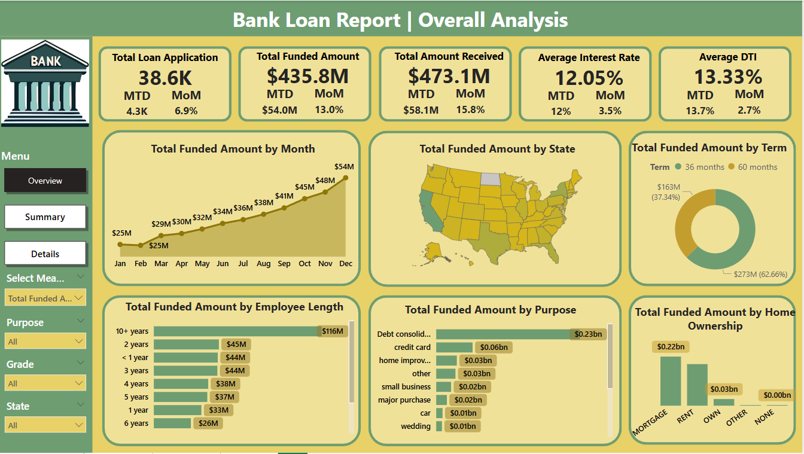
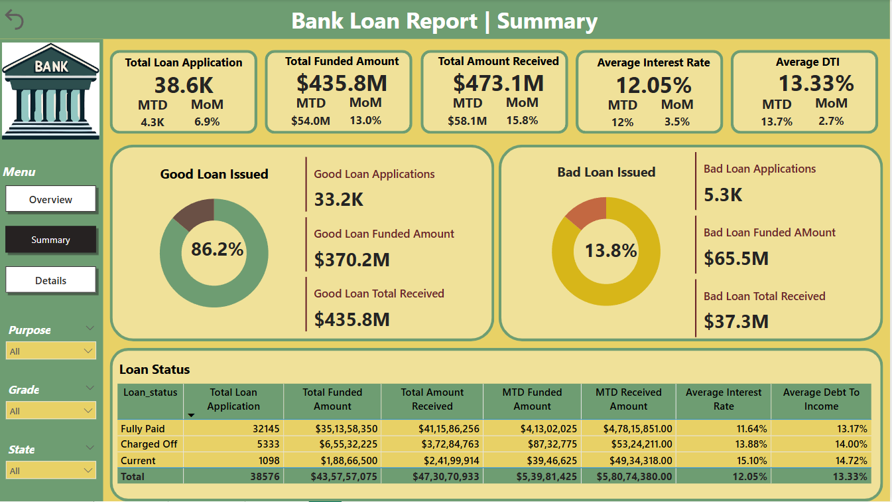

# 💰 Loan Data Analysis Project

  

## 📊 Overview
This loan analysis project provides a comprehensive review of loan application trends, funding distribution, borrower profiles, and repayment performance. With over 38.6K applications and $435.8M in funded loans, the report highlights a strong 13% month-over-month growth in disbursement. Key metrics such as interest rates (12.05%) and DTI (13.33%) were evaluated alongside borrower characteristics like employment length and home ownership. Most loans were taken for debt consolidation, while 60-month terms were the most popular. The analysis also compares good vs. bad loans, revealing an 86.2% repayment success rate. Insights from this data support better risk management, customer targeting, and strategic loan offerings.

## Dataset Used

The analysis is performed on a single table with the following columns:

| Column Name             | Description                                                  |
|-------------------------|--------------------------------------------------------------|
| `customer_id`           | Unique identifier for each customer                          |
| `address_state`         | U.S. state where the borrower resides                        |
| `application_type`      | Indicates whether the application is individual or joint     |
| `emp_length`            | Employment length of the borrower (e.g., 10+ years)          |
| `emp_title`             | Job title of the borrower                                    |
| `grade`                 | Loan grade assigned by the lender                            |
| `home_ownership`        | Type of home ownership (Rent, Own, Mortgage)                 |
| `issue_date`            | Date the loan was issued                                     |
| `last_credit_pull_date` | Most recent date a credit check was performed                |
| `last_payment_date`     | Date of last payment received                                |
| `loan_status`           | Current status of the loan (e.g., Fully Paid, Charged Off)   |
| `next_payment_date`     | Upcoming scheduled payment date                              |
| `member_id`             | Internal system identifier                                   |
| `purpose`               | Stated purpose for the loan (e.g., debt consolidation)       |
| `sub_grade`             | More granular sub-grade within the loan grade                |
| `term`                  | Length of the loan (e.g., 36 months, 60 months)              |
| `verification_status`   | Income verification status                                   |
| `annual_income`         | Annual income of the borrower                                |
| `dti`                   | Debt-to-Income ratio                                         |
| `installment`           | Monthly payment amount                                       |
| `int_rate`              | Interest rate of the loan                                    |
| `loan_amount`           | Total loan amount                                            |
| `total_acc`             | Total number of credit accounts                              |
| `total_payment`         | Total amount paid towards the loan                           |

## 📊 Key Analysis Areas

- Overall Analysis
  

    
  

1. Loan Applications & Funding Overview
   - Total Loan Applications: 38.6K
   - Month-over-Month (MoM) Growth: 6.9% (Healthy growth in demand for loans)
   - Total Funded Amount: $435.8M
   - MoM Growth: $54M (13%) – Significant increase in funding.
   - Total Amount Received: $473.1M
   - MoM Growth: $58.1M (15.8%) – Indicates strong loan recovery or revenue from funded loans.

2. Interest Rate & DTI
   - Average Interest Rate: 12.05% (MoM increase of 3.5%)
   - Average DTI (Debt-to-Income): 13.33% (MoM change 2.7%)
   - Slight increases but within manageable limits; needs monitoring if they continue upward.

3. Funding Trend Over the Year
   - Funded amount rose steadily from $25M in Jan/Feb to $54M in Dec. This shows consistent growth in lending activity, indicating improving trust or increased borrower needs

4. Funded Amount by State
   - Regional variation is visible, with higher funding in Eastern and Western states
   - Central states (e.g., North Dakota, South Dakota) show lower activity, suggesting either lower demand or stricter lending criteria

5. Loan Term Preference
   - 60-month loans account for 62.66% ($273M) of funding
   - 36-month loans contribute only 37.34% ($163M)
   - Customers prefer longer terms, possibly due to lower monthly payments

6. Funded Amount by Employment Length
    | Employment Length | Funded Amount |
    | ----------------- | ------------- |
    | 10+ years         | \$116M        |
    | <2 years          | \$45M         |
    | 6 years           | \$26M         |

   - Employees with 10+ years of service left received the highest funding ($116M)
   - Consistent funding across 2-5 year employment ranges, all around $33M to $45M
   - 6-year tenure had the lowest funding at $26M.
   ***(Suggests trust in stable employment history for loan approval)***

8. Loan Purpose

    | Purpose            | Funded Amount |
    | ------------------ | ------------- |
    | Debt Consolidation | \$0.23B       |
    | Credit Card        | \$0.06B       |
    | Home Improvement   | \$0.03B       |
    | Small Business     | \$0.02B       |
    | Wedding            | \$0.01B       |

   - Debt Consolidation leads with $0.23B (53%) of funding
   - Followed by Credit Card ($0.06B), Home Improvement ($0.03B)
   - Lowest: Wedding, Car, Major Purchase
   - Borrowers are largely seeking to manage or refinance existing debt, indicating economic caution

9. Home Ownership Status
    | Home Ownership | Funded Amount |
    | -------------- | ------------- |
    | Mortgage       | \$0.22B       |
    | Rent           | \$0.10B       |
    | Own            | \$0.03B       |
    | Other/None     | Minimal       |

   - Mortgage holders dominate the funded amount with $0.22B
   - Followed by Renters ($0.1B) and Owners ($0.03B)
   - Indicates lenders are more confident funding those with secured assets (mortgages)

- Analytical Summary
  

    
  

