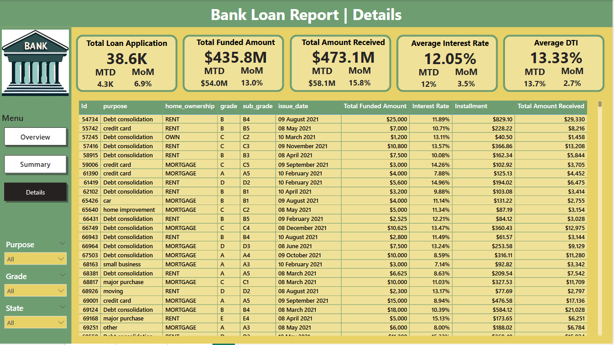

# 💰 Loan Data Analysis Project

  

## 📊 Business Problem
The bank faced rising default rates and inconsistent portfolio performance across different borrower profiles, time periods, and geographies. They need to optimize their loan offerings and improve customer segmentation to maximize profitability while minimizing risk. They have observed varying loan application behaviors across different borrower profiles based on factors such as homeownership status, employment tenure, loan purpose, loan term, and geographical region. The goal is to refine our loan products, tailor them to the specific needs of different segments, and ensure that we mitigate risks effectively.

This loan analysis project provides a comprehensive review of loan application trends, funding distribution, borrower profiles, and repayment performance. 
The goal is to refine their loan products, tailor them to specific customer needs, and mitigate risks effectively. The Power BI dashboard is prepared to analyze loan portfolio data and provide insights on which loan terms and purposes resonate most with different segments, how to personalize offerings based on homeownership and employment tenure, and identify high-potential regions for targeted marketing.

## Dataset Used

The analysis is performed on a single table with the following columns:

| Column Name             | Description                                                  |
|-------------------------|--------------------------------------------------------------|
| `customer_id`           | Unique identifier for each customer                          |
| `address_state`         | U.S. state where the borrower resides                        |
| `application_type`      | Indicates whether the application is individual or joint     |
| `emp_length`            | Employment length of the borrower (e.g., 10+ years)          |
| `emp_title`             | Job title of the borrower                                    |
| `grade`                 | Loan grade assigned by the lender                            |
| `home_ownership`        | Type of home ownership (Rent, Own, Mortgage)                 |
| `issue_date`            | Date the loan was issued                                     |
| `last_credit_pull_date` | Most recent date a credit check was performed                |
| `last_payment_date`     | Date of last payment received                                |
| `loan_status`           | Current status of the loan (e.g., Fully Paid, Charged Off)   |
| `next_payment_date`     | Upcoming scheduled payment date                              |
| `member_id`             | Internal system identifier                                   |
| `purpose`               | Stated purpose for the loan (e.g., debt consolidation)       |
| `sub_grade`             | More granular sub-grade within the loan grade                |
| `term`                  | Length of the loan (e.g., 36 months, 60 months)              |
| `verification_status`   | Income verification status                                   |
| `annual_income`         | Annual income of the borrower                                |
| `dti`                   | Debt-to-Income ratio                                         |
| `installment`           | Monthly payment amount                                       |
| `int_rate`              | Interest rate of the loan                                    |
| `loan_amount`           | Total loan amount                                            |
| `total_acc`             | Total number of credit accounts                              |
| `total_payment`         | Total amount paid towards the loan                           |

## 📊 Key Analysis Areas 

**Overall Analysis**
  

    
  

1. Loan Applications & Funding Overview
   - Total Loan Applications: 38.6K
   - Month-over-Month (MoM) Growth: 6.9% (Healthy growth in demand for loans)
   - Total Funded Amount: $435.8M
   - MoM Growth: $54M (13%) – Significant increase in funding.
   - Total Amount Received: $473.1M
   - MoM Growth: $58.1M (15.8%) – Indicates strong loan recovery or revenue from funded loans.

2. Interest Rate & DTI
   - Average Interest Rate: 12.05% (MoM increase of 3.5%)
   - Average DTI (Debt-to-Income): 13.33% (MoM change 2.7%)
   - Slight increases but within manageable limits; needs monitoring if they continue upward.

3. Funding Trend Over the Year
   - Funded amount rose steadily from $25M in Jan/Feb to $54M in Dec. This shows consistent growth in lending activity, indicating improving trust or increased borrower needs

4. Funded Amount by State
   - Regional variation is visible, with higher funding in Eastern and Western states
   - Central states (e.g., North Dakota, South Dakota) show lower activity, suggesting either lower demand or stricter lending criteria

5. Loan Term Preference
   - 60-month loans account for 62.66% ($273M) of funding
   - 36-month loans contribute only 37.34% ($163M)
   - Customers prefer longer terms, possibly due to lower monthly payments

6. Funded Amount by Employment Length
    | Employment Length | Funded Amount |
    | ----------------- | ------------- |
    | 10+ years         | \$116M        |
    | <2 years          | \$45M         |
    | 6 years           | \$26M         |

   - Employees with 10+ years of service left received the highest funding ($116M)
   - Consistent funding across 2-5 year employment ranges, all around $33M to $45M
   - 6-year tenure had the lowest funding at $26M.
   ***(Suggests trust in stable employment history for loan approval)***

8. Loan Purpose

    | Purpose            | Funded Amount |
    | ------------------ | ------------- |
    | Debt Consolidation | \$0.23B       |
    | Credit Card        | \$0.06B       |
    | Home Improvement   | \$0.03B       |
    | Small Business     | \$0.02B       |
    | Wedding            | \$0.01B       |

   - Debt Consolidation leads with $0.23B (53%) of funding
   - Followed by Credit Card ($0.06B), Home Improvement ($0.03B)
   - Lowest: Wedding, Car, Major Purchase
   - Borrowers are largely seeking to manage or refinance existing debt, indicating economic caution

9. Home Ownership Status
    | Home Ownership | Funded Amount |
    | -------------- | ------------- |
    | Mortgage       | \$0.22B       |
    | Rent           | \$0.10B       |
    | Own            | \$0.03B       |
    | Other/None     | Minimal       |

   - Mortgage holders dominate the funded amount with $0.22B
   - Followed by Renters ($0.1B) and Owners ($0.03B)
   - Indicates lenders are more confident funding those with secured assets (mortgages)

## Business Recommendation

   - Assign dynamic interest rates based on borrower profile instead of flat bands
   - Monitor “Current” loans with >14% DTI and >15% interest — they are high-risk
   - Auto-generate intervention alerts, offer restructuring early
   - Offer starter loans to <2-year employees with financial education support. Building long-term relationships with first-time borrowers might reduce the churn
   - Launch campaigns for business, home improvement loans
   - Launch low-cost digital acquisition strategies in underperforming states
   - Partner with regional influencers or local banks to improve footprint
   - Design offers around peak borrowing months (e.g., Q4) 

**Analytical Summary**
  

    
  

  
1. Good Loans Dominate the Portfolio
   - 86.2% of all loans are categorized as “Good”, meaning they were either fully paid or currently in good standing
   - These 33.2K loans had a funded amount of $370.2M, and impressively, the bank recovered the full $435.8M (including interest)
   - Most of our borrowers are reliable—this builds a strong foundation for future expansion

2. Bad Loans Aare low in number but significant
   - 13.8% of loans (5.3K) were charged off, meaning the bank was unable to recover the full amount
   - While $65.5M was funded, only $37.3M was recovered—an approximate 43% loss
   - One in seven loans are turning bad, need to tighten screening process and risk models

3. Loan Status Breakdown Reveals Key Trends
   
    | Status          | Funded Amount | Received Amount | Avg. Interest | Avg. DTI |
    | --------------- | ------------- | --------------- | ------------- | -------- |
    | **Fully Paid**  | \$351.36M     | \$411.58M       | **11.64%**    | 13.17%   |
    | **Charged Off** | \$65.53M      | \$37.28M        | **13.88%**    | 14.00%   |
    | **Current**     | \$18.87M      | \$24.19M        | **15.10%**    | 14.72%   |

   - Higher interest and DTI are clearly linked to default risk
   - Loans with lower interest and DTI (like fully paid ones) perform significantly better
   - When the risk goes up when interest is pushed and lend to customers with high DTI ratios

## Key Insights
  

    
  

  
   - Loan Growth is Strong: With 38.6K applications and a 13% MoM increase in funding, the bank is seeing steady growth in both demand and disbursement
   - High Loan Performance: 86.2% of loans are performing well, indicating effective credit policies and borrower reliability
   - Risk Linked to High DTI & Interest Rates: Charged-off loans show higher interest (13.88%) and DTI (14%), signaling a clear link between these factors and default risk
   - Debt Consolidation Dominates: Over 50% of the total funded amount is for debt consolidation, suggesting financial stress among borrowers
   - Long-Term & Mortgage-Backed Borrowers Preferred: Most funding goes to 60-month loans and mortgage holders, showing a focus on lower-risk, asset-backed lending

## Business Recommendation

   - Expand offerings for borrowers with lower DTI and stable income—they consistently repay well
   - Use incentives like lower interest rates or loyalty bonuses to attract more of this group
   - Set stricter thresholds on DTI (e.g., <13.5%) and cap interest rates for first-time or unknown borrowers
   - Analyze why these 5.3K loans failed—are they tied to certain regions, purposes, or professions
   - Build early-warning systems based on interest, DTI, and behavior patterns to intervene before charge-off
   - With consistent MoM growth, leverage marketing campaigns and special offers in high-performing months
   - Since many are consolidating debt, offer debt management tools, personal finance coaching, or budgeting apps as value-added services.Build trust and increase repayment rates long-term

## 📌 Conclusion

The loan analysis reveals a strong and growing loan portfolio, with 38.6K applications and a 13% month-over-month increase in funding, indicating rising borrower demand and effective disbursement strategies. A significant 86.2% of loans are performing well, showing that the bank has a stable and reliable customer base. However, the 13.8% of charged-off loans, often linked to higher interest rates and DTI ratios, highlight areas of potential risk that need attention.

The analysis also shows that debt consolidation is the leading loan purpose, suggesting that many borrowers are focused on managing existing financial burdens rather than taking loans for investment or asset-building. Borrowers with long employment history and mortgage backing received the highest funding, indicating the bank’s preference for low-risk, stable profiles. Lastly, the preference for longer-term loans (60 months) points to borrowers’ desire for manageable monthly repayments, but this may also increase the long-term credit risk if not closely monitored.

In summary, while the bank is in a strong position with high recovery and repayment rates, strategic focus on risk mitigation, borrower education, and product diversification will be essential for sustainable growth.
