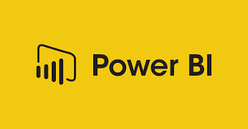

# Power BI Portfolio Projects

  

Welcome to my personal Power BI portfolio repository! Here you will find a collection of Power BI projects and dashboards that demonstrate my skills and expertise in data visualization, business intelligence, and analytics using Power BI.

## About Me
I am a passionate data enthusiast with a strong background in Power BI. I love transforming raw data into meaningful insights, creating interactive dashboards, and helping businesses make data-driven decisions. This portfolio showcases my proficiency in Power BI and highlights my ability to effectively communicate complex data visually. 

---
## [Project 1: Sales Dashboard]

Consumable Sales Dashboard, a powerful and intuitive data visualization tool built using Power BI. This dashboard offers a comprehensive view of sales data for consumable products, allowing you to quickly and easily analyze performance and identify trends.

## [Project 2: Superstore Sales Dashboard with Streamlit]

Superstore Sales with Streamlit is a data visualization and analysis project that uses the Streamlit framework to create an interactive web application for exploring and analyzing sales data from a superstore. This project aims to provide an easy-to-use interface for users to gain insights into sales trends, Sales performance, product performance, Shippin analysis and Location analysis. 

## [Project 3: Human Resource Dashboard]

## Contact Information

If you have any questions, feedback, or collaboration opportunities, please feel free to reach out to me. You can contact me via email at [info@tushar-aggarwal.com](mailto:info@tushar-aggarwal.com) or connect with me on LinkedIn at.

Thank you for visiting my Data Analysis Portfolio! I hope you find my projects informative and insightful.

 
